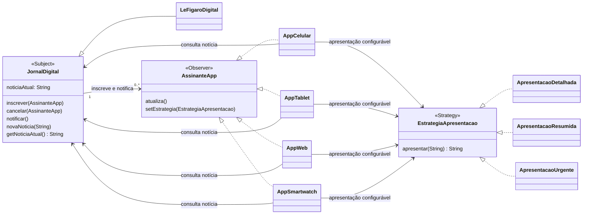

# Observer e Strategy

O diagrama mostra principalmente como o padrão **Observer** é usado para distribuir notícias do jornal aos aplicativos inscritos. O padrão **Strategy** aparece como apoio: cada aplicativo pode escolher como apresentar a notícia.

Quando `novaNoticia` é chamada, `JornalDigital` atualiza a notícia e chama `notificar()`. Cada `AssinanteApp` inscrito recebe `atualiza()`, consulta a notícia atual e a apresenta usando sua estratégia configurada. `cancelar()` remove o aplicativo da lista de notificações.