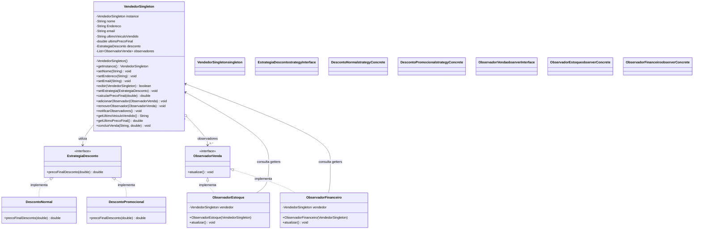

# Diagrama UML de Classes — Sistema de Vendas



**Notas UML:**

* `VendedorSingleton.instance` é estático e `VendedorSingleton()` é privado.
* `getInstance()` também é estático.
* As duas estratégias implementam `EstrategiaDesconto`.
* Os dois observadores implementam `ObservadorVenda`.
* Os observadores mantêm referências a `VendedorSingleton` e consultam `getUltimoVeiculoVendido()` e `getUltimoPrecoFinal()`.

```

### Um detalhe importante

A sintaxe de classes e relacionamentos acima é compatível com Mermaid. Para representar os membros estáticos com rigor, porém, o diagrama precisaria usar a notação específica suportada pela versão do Mermaid instalada no seu renderizador. Os atributos e métodos foram mantidos fiéis ao código enviado.

Se ainda aparecer um erro, envie a nova mensagem e eu corrijo a sintaxe exata que seu renderizador exige.
```
