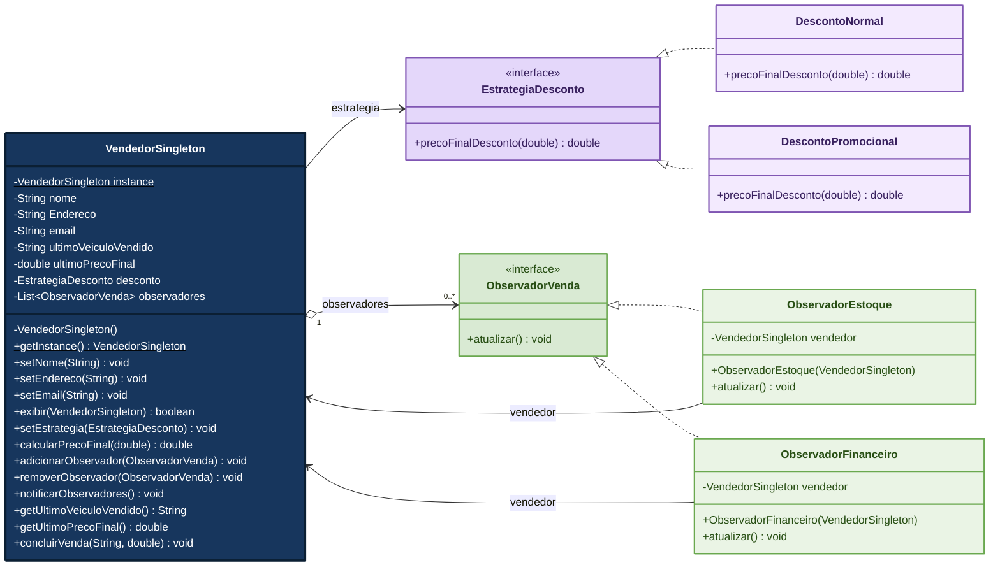

# Diagrama UML de Classes — Sistema de Vendas

```mermaid
classDiagram
    direction LR

    class VendedorSingleton {
        -VendedorSingleton instance$
        -String nome
        -String Endereco
        -String email
        -String ultimoVeiculoVendido
        -double ultimoPrecoFinal
        -EstrategiaDesconto desconto
        -List~ObservadorVenda~ observadores
        -VendedorSingleton()
        +getInstance() VendedorSingleton$
        +setNome(String) void
        +setEndereco(String) void
        +setEmail(String) void
        +exibir(VendedorSingleton) boolean
        +setEstrategia(EstrategiaDesconto) void
        +calcularPrecoFinal(double) double
        +adicionarObservador(ObservadorVenda) void
        +removerObservador(ObservadorVenda) void
        +notificarObservadores() void
        +getUltimoVeiculoVendido() String
        +getUltimoPrecoFinal() double
        +concluirVenda(String, double) void
    }

    class EstrategiaDesconto {
        <<interface>>
        +precoFinalDesconto(double) double
    }

    class DescontoNormal {
        +precoFinalDesconto(double) double
    }

    class DescontoPromocional {
        +precoFinalDesconto(double) double
    }

    class ObservadorVenda {
        <<interface>>
        +atualizar() void
    }

    class ObservadorEstoque {
        -VendedorSingleton vendedor
        +ObservadorEstoque(VendedorSingleton)
        +atualizar() void
    }

    class ObservadorFinanceiro {
        -VendedorSingleton vendedor
        +ObservadorFinanceiro(VendedorSingleton)
        +atualizar() void
    }

    VendedorSingleton --> EstrategiaDesconto : estrategia
    EstrategiaDesconto <|.. DescontoNormal
    EstrategiaDesconto <|.. DescontoPromocional

    VendedorSingleton "1" o--> "0..*" ObservadorVenda : observadores
    ObservadorVenda <|.. ObservadorEstoque
    ObservadorVenda <|.. ObservadorFinanceiro

    ObservadorEstoque --> VendedorSingleton : vendedor
    ObservadorFinanceiro --> VendedorSingleton : vendedor

    style VendedorSingleton fill:#17365D,color:#FFFFFF,stroke:#0B1F33,stroke-width:3px
    style EstrategiaDesconto fill:#E4D7FA,color:#38205E,stroke:#8056B3,stroke-width:2px
    style DescontoNormal fill:#F3EAFE,color:#38205E,stroke:#8056B3,stroke-width:2px
    style DescontoPromocional fill:#F3EAFE,color:#38205E,stroke:#8056B3,stroke-width:2px
    style ObservadorVenda fill:#D9EAD3,color:#274E13,stroke:#6AA84F,stroke-width:2px
    style ObservadorEstoque fill:#EAF4E5,color:#274E13,stroke:#6AA84F,stroke-width:2px
    style ObservadorFinanceiro fill:#EAF4E5,color:#274E13,stroke:#6AA84F,stroke-width:2px
```
