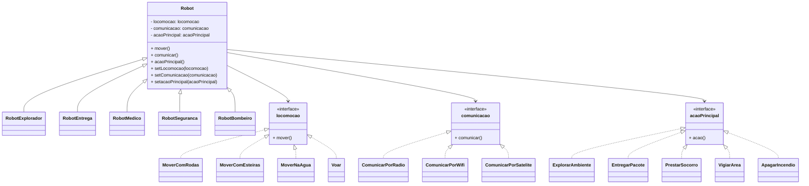

# Padrão Strategy

Este projeto aplica o padrão de projeto Strategy para permitir que diferentes robôs alterem dinamicamente sua forma de se locomover, comunicar e executar ações, sem mudar a estrutura base da classe `Robot`.

## Conceito

A classe `Robot` encapsula três comportamentos variáveis:

- `locomocao`
- `comunicacao`
- `acaoPrincipal`

Cada um desses comportamentos é representado por uma interface, e cada estratégia concreta implementa a lógica específica.

## Diagrama UML (Mermaid)



## Como o padrão aparece no código

- `Robot` é o contexto.
- `locomocao`, `comunicacao` e `acaoPrincipal` são as interfaces de estratégia.
- As classes como `MoverComRodas`, `ComunicarPorRadio` e `ExplorarAmbiente` implementam as estratégias concretas.
- Cada robô escolhe uma combinação inicial de estratégias no construtor.
- Métodos como `setLocomocao`, `setComunicacao` e `setacaoPrincipal` permitem trocar a estratégia em tempo de execução.

Exemplo no código:

```java
r4.setacaoPrincipal(new ExplorarAmbiente());
r4.setComunicacao(new ComunicarPorWifi());
r4.setLocomocao(new MoverComEsteiras());
```

Isso demonstra a flexibilidade do Strategy: o comportamento do robô pode mudar sem alterar seu tipo ou a lógica principal da classe base.
